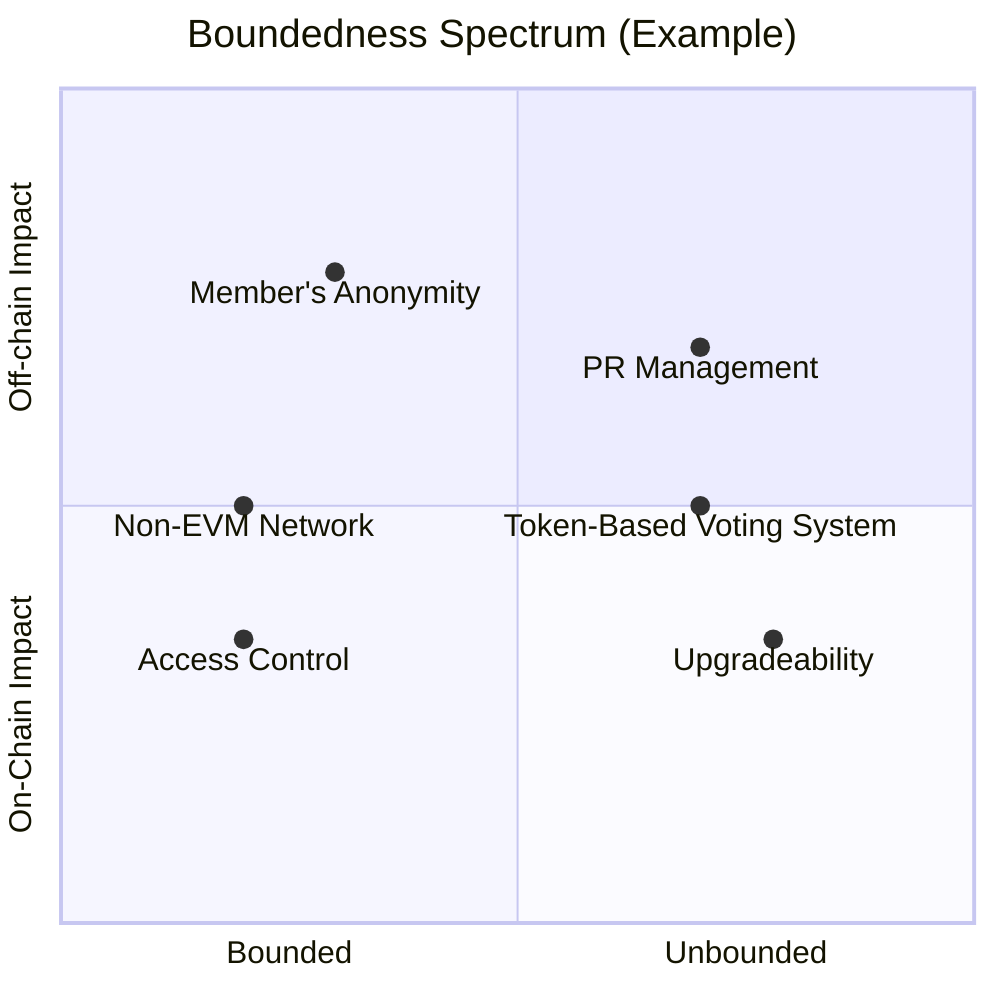

DAOs are inherently interactive, since they arise as a response to governance needs in the Web3 space. But these interactions can dramatically shift a DAO's behavior and objectives. The boundaries that a DAO implements over its interactivity are crucial, but many times overlooked. Normalizing or neglecting boundaries can sabotage any DAO, and even leaving it open to attacks. 

We'll share a set of concepts that can assist in raising awareness on a DAO's boundedness and promote its success. 

---

## Bounded / Unbounded

A system's boundaries are the result of its components and their behavior. In the case of DAOs, its smart contracts, access control architecture and network infrastructure are among the components that will condition interactivity. We are not going to delve into how each specific component handles boundedness, but focus on the boundaries structure itself. Also remember that boundaries not only affect on-chain behavior, but also potential integration with off-chain mechanisms, legal structures and real-world governance.

By default, DAOs are open to external interaction. Most DAOs have token-based voting systems that allow anyone able to acquire the token to engage with its governance capabilities. Additionally, EVM-compatible networks are the norm to create a DAO, which makes its smart contracts widely readable. We'll label a DAO implementing this type of open boundaries structure an **unbounded DAO**. Therefore, if we are interacting with a DAO, *it is reasonable to assume at the beginning that is unbounded*. A closer examination will specify its actual boundaries structure. 

On the other hand, a **bounded DAO** implements restrictions on its interactivity level. This can take the form of closed voting systems, EVM-incompatible networks, non-upgradeable contracts, and so on. Some of these restrictions are hard to implement, which disincentive bounded DAOs, reducing its frequency. The bounded/unbounded terminology may apply to a DAO's intentions as well as its configuration. We propose a distinction between boundedness as a **trait** (based on components) and as a **motive** (based on design priorities).

---

## Boundedness as Trait

Most of the time we can assess a DAO's boundedness by examining its **components**. Some of them are straight forward: access control systems close DAO's boundaries, pushing it to the **bounded** categorization. Others are more problematic: cross-chain interoperability is a proper **unbounded** trait, but it may require implementing restrictions in other areas to prevent attacks. 

This complexity requires a boundedness **spectrum**, one that can take into account how each component tries to steer a DAO into the bounded or unbounded territory. Additionally, a DAO's governance, voting mechanisms and smart contracts may develop overtime. These changes will shift a DAO's position on this spectrum. A DAO's boundedness can become so complex that it may require analyzing multiple layers of the spectrum—each of them featuring specific aspects of a DAO's interactivity.

As important as this spectrum is, we need to add to our discussion how designing principles and motivations affect a DAO's boundaries. 

---

## Boundedness as Motive

At the design stage, any DAO must confront important decisions that will affect its outcome. These decisions may have a boundedness dimension, even if the DAO's designers are unaware of it. For example, choosing an L2 network will reduce operation costs. This choice may occur exclusively for economic reasons, but also can be an intentional decision to promote governance participation. If the last option is the case, we have encountered an unbounded DAO—not determined by its components but by design motivation.

In this boundedness aspect, bounded and unbounded are **binary** choices. A DAO's **priorities** become the main attribute for analysis. Despite each development decision having its influence, a priorities stack forms—either intentionally or by design choices. And this hierarchy will point towards a bounded or unbounded outcome. Boundedness priorities may be segmented—a DAO could aspire to be unbounded on-chain but bound its off-chain interactivity.

| **BOUNDEDNESS ASPECT** | **MAIN DAO ATTRIBUTE** | **BOUNDEDNESS DYNAMIC** |
|---|---|---|
| Trait | Components | Spectrum |
| Motive | Priorities | Binary |

A flawed evaluation of DAO's components and priorities will lead us to mishandle its design and development, as we'll see shortly.

---

## Boundedness Mishandling 

If DAO's priorities are not well established, there’s no clear foundation for guiding decisions. Our lack of awareness will promote false expectations and defective responsiveness. For example: access control is a great tool to bound interactivity. But we can set them carelessly if we are not aware of the priority that is serving. If we add access control as part of a checklist instead of a clear priority, we can't be surprised when an admin loses their keys, and we end up locked out.

But that’s not the only way boundedness can be mishandled. Let's go back to our L2 network example. Even if a DAO chooses an L2 for unbounded motivations, this could backfire. While an L2 is operationally cheaper, it is also harder to operate for inexperienced users. This may create incongruity between boundedness motives and traits, leading to unmet expectations in a DAO's performance.

Incongruity may also occur even if priorities are properly set and executed. For example, a DAO could prioritize members' anonymity after deployment. But if proper measures weren't established from the start, admins could have left traces of their identities. In the future, that initial mishandling could lead to member's off-line exposure. This is but a small sample of the abundant ways boundedness is frequently mishandled. Before we leave, let's review a case study to develop our terminology.

---

## Case Study: DAO DAO

The [**DAO DAO**](https://daodao.zone/) framework allows the creation of DAOs on the Cosmos ecosystem and uses Rust for their smart contracts. Cosmos and Rust are uncommon, therefore restricting interactions with "outsiders". This is clearly a bounded framework—at least in boundedness traits. It could be possible to build a DAO with it that seeks being unbounded, but it would be *swimming against the current*.

DAOs built with DAO DAO will fall on a bounded/unbounded spectrum, but its components—intentionally or not—heavily prioritize distancing from the blockchain ecosystem and beyond. This example also offers an interesting aspect of boundedness. If in the future Cosmos and Rust become the prevalent options, DAOs built with DAO DAO may shift their boundedness classification. This reinforces our argument of the complexities of DAOs boundaries, which are never static.

We’ve covered some key aspects of DAO boundedness, and two terms that may assist in our boundaries' examination: bounded and unbounded. As you could see, this topic is far from exhausted—too many avenues for exploration remain active. We hope that this framework was of use, and we encourage you to apply this framework when analyzing DAOs. Stay in touch with **DAO Horizons** for future articles that will expand on these ideas.

Do you have any questions or suggestions? Please contact [**Lokapal Research**](../../contact/) and let's continue building a better horizon for DAOs. Thank you!
